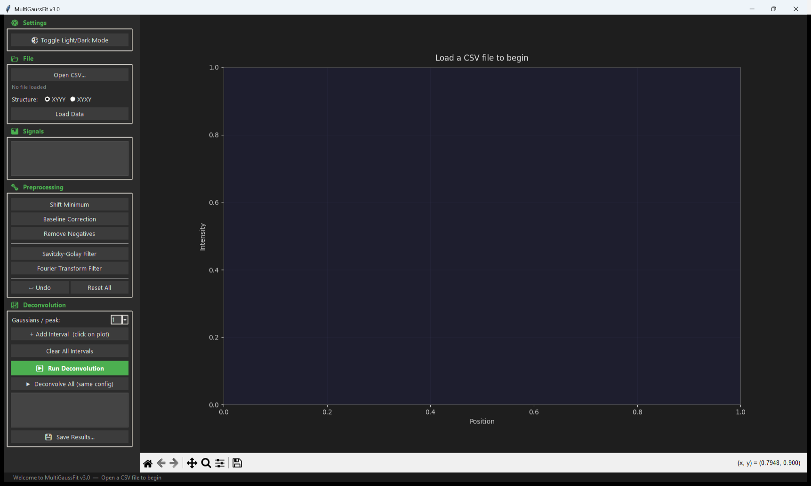

# MultiGaussFit

<p align="center">
  
</p>

A desktop GUI application for **interactive signal preprocessing** and **multi-Gaussian deconvolution**, built with Python and Tkinter. Designed for spectroscopists, analytical chemists, and researchers who need to decompose complex overlapping peaks into individual Gaussian components.

---

## Key Features

- **CSV Data Loading**: Supports both **XYYY** and **XYXY** column structures with automatic header detection.
- **Interactive Plot**: Real-time visualization with zoom, pan, and click-to-select functionality powered by Matplotlib.
- **Signal Preprocessing**:
  - Linear baseline correction
  - Minimum shift (translate signal so min = 0)
  - Negative value removal
  - Savitzky-Golay smoothing filter (configurable window and polynomial order)
  - Fourier Transform noise filter (configurable number of frequencies)
  - Full **Undo** and **Reset** support for all preprocessing steps
- **Multi-Gaussian Deconvolution**:
  - Click on the plot to define deconvolution intervals
  - Fit **1 or 2 Gaussians per peak** center
  - Optimization via **Differential Evolution** (global optimizer)
  - Displays individual Gaussian components, total fit, and **SSE** quality metric
- **Batch Processing**: Deconvolve the first signal manually, then automatically apply the same preprocessing pipeline and interval configuration to **all remaining signals** in the file.
- **Real-Time Results**: Peak parameters (Amplitude, Center, Width) are displayed live during batch processing.
- **Export to CSV**: Save preprocessed signals and deconvolution results with full peak parameters.
- **Dark/Light Theme**: Toggle between dark and light modes for comfortable viewing.
- **Windows Installer**: Pre-built Windows installer available via [Releases](https://github.com/1JELC1/MultiGaussFit/releases).

---

## Screenshot



---

## Workflow

The typical workflow in MultiGaussFit follows these steps:

1. **Open a CSV file** containing your spectral or signal data.
2. **Select the data structure** (XYYY or XYXY) and click **Load Data**.
3. **Select a signal** from the sidebar list to visualize it.
4. **Preprocess** the signal as needed:
   - Apply baseline correction, smoothing, or noise filtering.
   - Use **Undo** to step back or **Reset** to restore the original.
5. **Define deconvolution intervals** by clicking on the plot to mark peak boundaries.
6. **Run Deconvolution** — choose 1 or 2 Gaussians per peak and click Run.
7. **Inspect results** in the sidebar and on the plot (individual Gaussians, total fit, SSE).
8. *(Optional)* Click **Deconvolve All** to apply the same configuration to every signal in the file.
9. **Save Results** to CSV files for further analysis.

---

## Output Files

| File | Description |
|---|---|
| `{name}_preprocessed.csv` | Preprocessed signal values (Position + preprocessed Y for each signal) |
| `{name}_deconv.csv` | Deconvolution parameters: Amplitude, Center, Width, SSE, and raw Gaussian parameters per peak |

### Deconvolution CSV Columns

| Column | Description |
|---|---|
| `Signal` | Signal name from the original CSV |
| `Peak` | Peak number (1, 2, …) |
| `Amplitude` | Total amplitude of the peak |
| `Center` | Peak center position (μ) |
| `Width` | Peak width (σ) |
| `SSE` | Sum of Squared Errors for the fit |
| `a`, `mu`, `sigma` | Raw parameters (1 Gaussian mode) |
| `a1`, `a2`, `mu_raw`, `sigma1`, `sigma2` | Raw parameters (2 Gaussians mode) |

---

## Installation

### Option 1: Windows Installer (Recommended)

Download the latest **`MultiGaussFit_Setup.exe`** from the [Releases](https://github.com/1JELC1/MultiGaussFit/releases) page.

The installer will:
- Install MultiGaussFit to `Program Files`
- Create a Start Menu shortcut
- Optionally create a Desktop shortcut

> **No Python installation required.** Everything is bundled in the installer.

### Option 2: Run from Source

#### Using Conda (Recommended)

```bash
git clone https://github.com/1JELC1/MultiGaussFit.git
cd MultiGaussFit
conda env create -f environment.yml
conda activate multigaussfit
python MultiGaussFit.py
```

#### Using pip

```bash
git clone https://github.com/1JELC1/MultiGaussFit.git
cd MultiGaussFit
pip install -r requirements.txt
python MultiGaussFit.py
```

**Requirements**: Python 3.9+

---

## Building from Source

### Portable Executable (single file)

```bash
pyinstaller MultiGaussFit_onefile.spec
```

Output: `dist/MultiGaussFit.exe` (self-contained, ~120 MB)

### Fast-Startup Executable (directory)

```bash
pyinstaller MultiGaussFit_onedir.spec
```

Output: `dist/MultiGaussFit/` directory with fast startup time.

### Windows Installer

Requires [Inno Setup 6](https://jrsoftware.org/isinfo.php):

1. Build the `onedir` version first.
2. Compile the installer script:
   ```bash
   iscc installer/MultiGaussFit.iss
   ```
3. Output: `dist/MultiGaussFit_Setup.exe`

---

## Example Data

A sample CSV file is included in the [`examples/`](examples/) folder:

```bash
python MultiGaussFit.py
# Then open: examples/sample_signal.csv
```

---

## Technical Details

### Algorithm

MultiGaussFit uses **Differential Evolution** ([`scipy.optimize.differential_evolution`](https://docs.scipy.org/doc/scipy/reference/generated/scipy.optimize.differential_evolution.html)) for global optimization of Gaussian parameters. This stochastic optimizer avoids local minima that plague gradient-based methods, making it robust for overlapping peaks.

**Objective function**: Minimizes the Sum of Squared Errors (SSE) between the observed signal and the sum of Gaussian components within each user-defined interval.

### Gaussian Model

Each peak is modeled as:

$$G(x) = A \cdot \exp\left(-\frac{(x - \mu)^2}{2\sigma^2}\right)$$

Where:
- $A$ = amplitude
- $\mu$ = center position
- $\sigma$ = standard deviation (width)

In **2-Gaussian mode**, each peak center uses two Gaussians sharing the same μ but with independent amplitudes and widths, allowing asymmetric peak fitting.

### Preprocessing Pipeline

| Step | Method | Reference |
|---|---|---|
| Baseline Correction | Linear interpolation between minima of left/right halves | — |
| Savitzky-Golay | `scipy.signal.savgol_filter` | Savitzky & Golay, 1964 |
| Fourier Transform | Keep top-N frequency components via FFT/iFFT | — |
| Minimum Shift | $y' = y - \min(y)$ | — |
| Negative Removal | $y' = \max(y, 0)$ | — |

---

## Project Structure

```
MultiGaussFit/
├── MultiGaussFit.py           # Main application (source code)
├── logo.ico                   # Application icon (Windows)
├── logo.png                   # Application icon (high-res PNG)
├── requirements.txt           # pip dependencies
├── environment.yml            # Conda environment
├── CITATION.cff               # Citation metadata
├── LICENSE                    # Apache 2.0
├── MultiGaussFit_onefile.spec # PyInstaller spec (single file)
├── MultiGaussFit_onedir.spec  # PyInstaller spec (directory)
├── file_version_info.txt      # Windows EXE metadata
├── examples/
│   └── sample_signal.csv      # Example CSV data file
├── images/
│   ├── logo.png               # Logo for README
│   └── logo_multigaussfit.svg # Vector logo source
└── installer/
    └── MultiGaussFit.iss      # Inno Setup installer script
```

---

## Contributing

Contributions, issues, and feature requests are welcome!
Feel free to check the [issues page](https://github.com/1JELC1/MultiGaussFit/issues) if you want to report a bug or request a feature.

---

## Citation

If you use this software in your research, please cite it using the citation metadata provided in the [CITATION.cff](CITATION.cff) file.

---

## License

This project is licensed under the **Apache License 2.0** — see the [LICENSE](LICENSE) file for details.

**Publisher**: JELC
