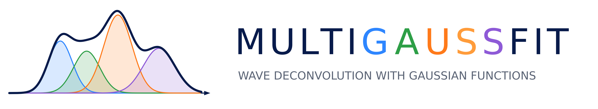

# MultiGaussFit

<p align="center">
  
</p>

<p align="center">
  <a href="https://doi.org/10.5281/zenodo.20060150">
    
  </a>
</p>

## About

**MultiGaussFit** is a desktop GUI application for interactive signal preprocessing and multi-Gaussian deconvolution. Built with Python and Tkinter, it is designed for spectroscopists, analytical chemists, and researchers who need to decompose complex overlapping peaks into individual Gaussian components. It provides a complete workflow from raw data loading through noise filtering, baseline correction, peak fitting, and batch export of results.

---

## Key Features

- **CSV Data Loading**: Supports both **XYYY** and **XYXY** column structures with automatic header detection.
- **Interactive Plot**: Real-time visualization with zoom, pan, and click-to-select functionality powered by Matplotlib.
- **Signal Preprocessing**:
  - Linear baseline correction
  - Minimum shift (translate signal so min = 0)
  - Negative value removal
  - Savitzky-Golay smoothing filter (configurable window and polynomial order)
  - Fourier Transform noise filter (configurable number of frequencies)
  - Full **Undo** and **Reset** support for all preprocessing steps
- **Multi-Gaussian Deconvolution**:
  - Click on the plot to define deconvolution intervals
  - Fit **1 or 2 Gaussians per peak** center
  - Optimization via **Differential Evolution** (global optimizer)
  - Displays individual Gaussian components, total fit, and **SSE** quality metric
- **Batch Processing**: Deconvolve the first signal manually, then automatically apply the same preprocessing pipeline and interval configuration to **all remaining signals** in the file.
- **Real-Time Results**: Peak parameters (Amplitude, Center, Width) are displayed live during batch processing.
- **Export to CSV**: Save preprocessed signals and deconvolution results with full peak parameters.
- **Dark/Light Theme**: Toggle between dark and light modes for comfortable viewing.

---

## Demo


https://github.com/user-attachments/assets/acc87a74-1c9b-484f-9194-2879499a28c9


---

## Workflow

The typical workflow in MultiGaussFit follows these steps:

### 1. Open a CSV file

Load a CSV file containing your spectral or signal data. MultiGaussFit supports two column structures:

#### XYYY Structure

A single shared X column (e.g. wavenumber, wavelength, time) followed by multiple Y columns, one per signal:

| Wavenumber (cm⁻¹) | Signal_A | Signal_B | Signal_C |
|---|---|---|---|
| 4000 | 0.0236 | 0.0195 | 0.0253 |
| 3998 | 0.0238 | 0.0171 | 0.0252 |
| 3996 | 0.0224 | 0.0180 | 0.0238 |
| ... | ... | ... | ... |

#### XYXY Structure

Alternating X–Y column pairs, where each signal has its own independent X axis:

| X_Signal_A | Signal_A | X_Signal_B | Signal_B |
|---|---|---|---|
| 4000 | 0.0236 | 4000 | 0.0195 |
| 3998 | 0.0238 | 3998 | 0.0171 |
| 3996 | 0.0224 | 3996 | 0.0180 |
| ... | ... | ... | ... |

### 2. Load Data

Select the correct data structure (**XYYY** or **XYXY**) and click **Load Data**. The available signals will appear in the sidebar.

### 3. Select a Signal

Click on any signal from the sidebar list to visualize it on the main plot.

### 4. Preprocess the Signal

Apply one or more preprocessing steps as needed:
- **Baseline Correction**: removes a linear baseline estimated from the signal edges.
- **Savitzky-Golay Filter**: smooths the curve to reduce high-frequency noise.
- **Fourier Transform Filter**: filters the signal in the frequency domain, keeping only the dominant frequency components.
- **Shift Minimum**: translates the signal so that its minimum value equals zero.
- **Remove Negatives**: sets any remaining negative values to zero.

Use **Undo** to step back one operation or **Reset All** to restore the original signal.

### 5. Define Deconvolution Intervals

Click on the plot to mark the boundaries (start and end) of each peak region you want to deconvolve.

### 6. Run Deconvolution

Choose 1 or 2 Gaussians per peak and click **Run Deconvolution**.

> **Tip:** If your peaks are sharp or pointed (i.e. they end in a narrow tip rather than a smooth rounded top), try using **2 Gaussians per peak**. The two-Gaussian mode can better capture the cusp-like shape of sharp signals that a single Gaussian cannot reproduce.

### 7. Inspect Results

The fitted Gaussian components, total fit curve, and SSE quality metric are shown on the plot. Peak parameters (Amplitude, Center, Width) appear in the results panel.

### 8. Batch Processing *(optional)*

Click **Deconvolve All (same config)** to automatically apply the same preprocessing pipeline and deconvolution intervals to every signal in the file. Results update in real time.

### 9. Save Results

Click **Save Results...** to export preprocessed signals and deconvolution parameters to CSV files.

---

## Output Files

| File | Description |
|---|---|
| `{name}_preprocessed.csv` | Preprocessed signal values (Position + preprocessed Y for each signal) |
| `{name}_deconv.csv` | Deconvolution parameters per peak: Amplitude, Center, Width, SSE |

### Deconvolution CSV Columns

| Column | Description |
|---|---|
| `Signal` | Signal name from the original CSV |
| `Peak` | Peak number (1, 2, …) |
| `Amplitude (A)` | Total amplitude of the peak (in 2-Gaussian mode: $A_1 + A_2$) |
| `Center (µ)` | Peak center position |
| `Width (σ)` | Peak width (standard deviation) |
| `SSE` | Sum of Squared Errors for the fit |
| `a1`, `a2`, `sigma1`, `sigma2` | Individual Gaussian parameters (only in 2-Gaussian mode) |

---

## Installation

### Windows Installer (Recommended)

[⬇ Download MultiGaussFit_Setup.exe](https://github.com/1JELC1/MultiGaussFit/releases/download/v1.0.0/MultiGaussFit_Setup.exe)

The installer will:
- Install MultiGaussFit to `Program Files`
- Create a Start Menu shortcut
- Optionally create a Desktop shortcut

> **No Python installation required.** Everything is bundled in the installer.

<details>
<summary><strong>Run from Source</strong></summary>

#### Using Conda

```bash
git clone https://github.com/1JELC1/MultiGaussFit.git
cd MultiGaussFit
conda env create -f environment.yml
conda activate multigaussfit
python MultiGaussFit.py
```

#### Using pip

```bash
git clone https://github.com/1JELC1/MultiGaussFit.git
cd MultiGaussFit
pip install -r requirements.txt
python MultiGaussFit.py
```

**Requirements**: Python 3.9+

</details>

<details>
<summary><strong>Building from Source</strong></summary>

### Portable Executable (single file)

```bash
pyinstaller MultiGaussFit_onefile.spec
```

Output: `dist/MultiGaussFit.exe` (self-contained, ~120 MB)

### Fast-Startup Executable (directory)

```bash
pyinstaller MultiGaussFit_onedir.spec
```

Output: `dist/MultiGaussFit/` directory with fast startup time.

### Windows Installer

Requires [Inno Setup 6](https://jrsoftware.org/isinfo.php):

1. Build the `onedir` version first.
2. Compile the installer script:
   ```bash
   iscc installer/MultiGaussFit.iss
   ```
3. Output: `dist/MultiGaussFit_Setup.exe`

</details>

---

## Example Data

A sample CSV file is included in the [`examples/`](examples/) folder:

```bash
python MultiGaussFit.py
# Then open: examples/sample_signal.csv
```

---

## Technical Details

### Optimization Algorithm

MultiGaussFit uses **Differential Evolution** ([`scipy.optimize.differential_evolution`](https://docs.scipy.org/doc/scipy/reference/generated/scipy.optimize.differential_evolution.html)) for global optimization of Gaussian parameters. Differential Evolution is a stochastic, population-based optimizer that explores the entire parameter space without requiring an initial guess. Unlike gradient-based methods (e.g. Levenberg-Marquardt), it does not get trapped in local minima, which makes it particularly robust when fitting overlapping or poorly resolved peaks.

**Objective function**: The optimizer minimizes the **Sum of Squared Errors (SSE)** between the observed signal and the sum of Gaussian components within each user-defined interval:

$$\text{SSE} = \sum_{i} \left[ y_i - \sum_{k} G_k(x_i) \right]^2$$

A lower SSE indicates a better fit.

### Gaussian Model

#### 1-Gaussian Mode

Each peak is modeled as a single Gaussian function:

$$G(x) = A \cdot \exp\left(-\frac{(x - \mu)^2}{2\sigma^2}\right)$$

Where:
- $A$ = amplitude (peak height)
- $\mu$ = center position
- $\sigma$ = standard deviation (controls the width)

This mode works well for peaks with a smooth, rounded, symmetric shape.

#### 2-Gaussian Mode (for sharp / pointed peaks)

When a peak is **sharp or pointed** (i.e. it has a narrow, cusp-like tip rather than a smooth rounded maximum), a single Gaussian cannot accurately reproduce its shape. In this case, MultiGaussFit uses **two Gaussians sharing the same center position** $\mu$ but with independent amplitudes and widths:

$$G_{\text{total}}(x) = A_1 \cdot \exp\left(-\frac{(x - \mu)^2}{2\sigma_1^2}\right) + A_2 \cdot \exp\left(-\frac{(x - \mu)^2}{2\sigma_2^2}\right)$$

Where:
- $\mu$ = shared center position (both Gaussians are centered at the same point)
- $A_1$, $A_2$ = individual amplitudes
- $\sigma_1$, $\sigma_2$ = individual widths (typically one narrow, one broad)

The **total peak height** at the center is the sum $A_1 + A_2$, which can be used directly for quantification. One Gaussian captures the sharp, narrow core of the peak while the other captures the broader base, together reproducing the pointed shape that a single Gaussian cannot fit.

### Preprocessing Pipeline

| Step | Equation | Method |
|---|---|---|
| Baseline Correction | $y' = y - L(x)$ | Estimates a linear baseline $L(x)$ by interpolating between the minima of the left and right halves of the signal, then subtracts it. Used to remove a sloped or offset background from the raw signal. |
| Savitzky-Golay Filter | Polynomial fit over a sliding window | Noise filtering and smoothing method. Fits a low-degree polynomial to successive subsets of data points using least-squares regression (`scipy.signal.savgol_filter`). Reduces high-frequency noise while preserving peak shape and height. Configurable window size and polynomial order. |
| Fourier Transform Filter | $y' = \text{iFFT}[\text{top-}N\text{ components of FFT}(y)]$ | Noise filtering and smoothing method. Transforms the signal to the frequency domain via FFT, retains only the $N$ most dominant frequency components (low-frequency = signal shape), and reconstructs the signal via inverse FFT. Removes high-frequency noise and oscillations. The number of retained frequencies $N$ is configurable. |
| Minimum Shift | $y' = y - \min(y)$ | Translates the entire signal vertically so that its minimum value equals zero. Useful to remove any residual negative offset after baseline correction. |
| Negative Removal | $y' = \max(y, 0)$ | Clips any remaining negative values to zero. Ensures the signal is non-negative before deconvolution, which assumes positive-definite Gaussian components. |

---

## Contributing

Contributions, issues, and feature requests are welcome!
Feel free to check the [issues page](https://github.com/1JELC1/MultiGaussFit/issues) if you want to report a bug or request a feature.

---

## Citation

If you use this software in your research, please cite it using the citation metadata provided in the [CITATION.cff](CITATION.cff) file.

---

## License

This project is licensed under the **Apache License 2.0** — see the [LICENSE](LICENSE) file for details.

**Publisher**: JELC
